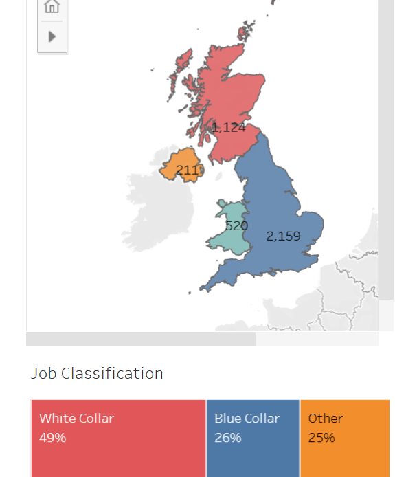
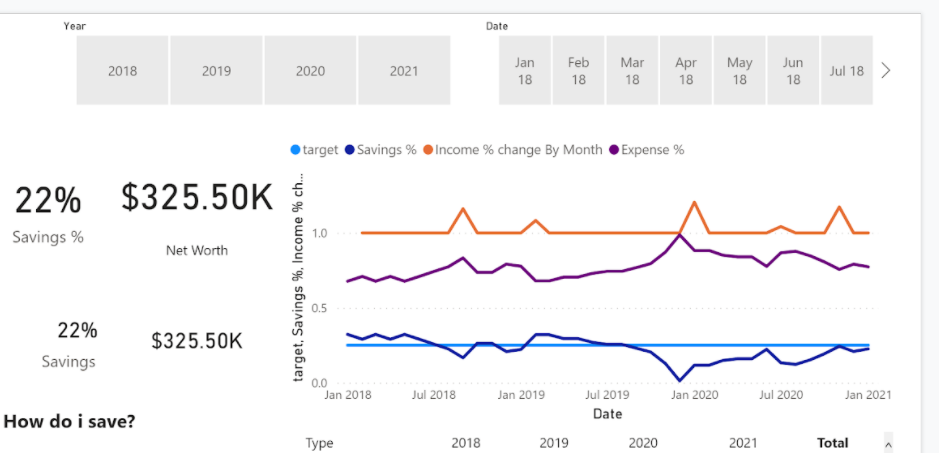
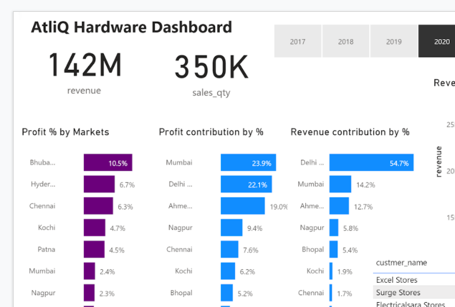

# Kavya Gowda Portfolio  | kavyagowda987654@gmail.com | +91 7975376285 | www.linkedin.com/in/kavya-gowda-05144915a | https://public.tableau.com/app/profile/kavya.gowda 

# [Project 1: Learnplatform digital learning EDA: Project Overview](https://www.kaggle.com/kavyagowdala/exploratory-data-analysis)
* Conducted exploratory data analysis to find insights on The state of digital learning in 2020 from a 
dataset taken from the Kaggle competition. 
* Fixed the data types and examined the missing values for Data cleaning. 
* Using Python packages such as NumPy and Pandas merged many individual files into 1 data frame of 
2.2M records with 16 features. 
* Matplotlib and Seaborn were used to visualize How the student engagement of digital learning relates
to factors such as district demographics, broadband access, and state/national level policies and 
events.

# [Project 2: Stanford Open Policing Project Data Analysis](https://www.kaggle.com/kavyagowdala/stanford-open-policing-project-data-analysis)
* Analysing Data on Traffic and Pedestrian Stops by Police in California to get insights to help researchers, journalists, and policymakers investigate and improve interactions between police and the public.
* Implementation of data mining techniques Using Python Packages such as Pandas, Seaborn, Matplotlib.
* visualized how predictable are the stop rates? Are there times and places that
reliably generate stop. 

# [Project 3: Customer Segmentation Analysis](https://public.tableau.com/app/profile/kavya.gowda/viz/CustomerSegmentationAnalysis_16388900281370/Story1)
* Conducted Customer Segmentation Analysis based on region, age, gender, account balance and job classification on Bank operating in UK to get insights for target marketing.  

# [Project 4: Personal Finance Data Analysis: Project Overview](https://drive.google.com/drive/folders/1nNqdnMJ75bjV0IHLtXqMUTVnq1Y-ESeH?usp=sharing)
* Implementation of data mining techniques to gain insights in finance data taken from GitHub.
* Created an interactive dashboard to get an understanding of spending and saving habits year over year 
using timeline slicer and tool tip.
* Created measures using Dax functions (SUM, FILTER, ALL, CALCULATE)

# [Project 5: AtliQ Hardware Sales insights Data Analysis ](https://drive.google.com/drive/folders/1nNqdnMJ75bjV0IHLtXqMUTVnq1Y-ESeH?usp=sharing)
* Conducted data analysis using complex SQL Queries, joins, functions to understand the sales.
* Created an interactive Dashboard in power BI using DAX functions (FILTER, ALL, CALCULATE, SUM) 
to create measures.
* Displayed compelling visuals of profit and revenue distribution by percentage with interactive timeline 
slicer.

